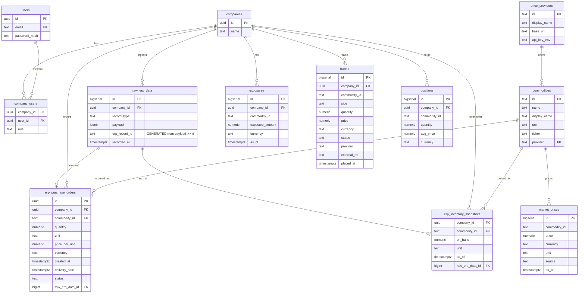

# Database (`db/`)

The platform uses a single shared **Postgres** database for local development and (later) Supabase Postgres in remote environments.

### Goals

- **Multi-tenant by design**: company-scoped tables include `company_id`.
- **Shared schema**: one DB, one set of migrations, no per-service databases.
- **Idempotent ingest**: raw ERP payloads are deduped using a computed `erp_record_id`.

### Quick start (local)

Reset everything (drop DB, apply all migrations, seed demo data):

```bash
docker compose up -d db
./db/re-init.sh
```

### What `re-init.sh` does

`db/re-init.sh`:

- Drops & recreates the `app` database.
- Runs every `.sql` file in `db/migrations/` in **lexicographic order** (numeric prefix).
- Applies `db/dev_seed.sql`.

### Migrations

Migrations live in `db/migrations/` and must use unique numeric prefixes:

- `0001_init.sql`: core schema (tenancy + market + trades + raw ERP)
- `0002_commodities_and_structured_erp.sql`: `commodities` + `erp_purchase_orders`
- `0003_raw_unique_index.sql`: extra raw ERP uniqueness/indexing
- `0004_raw_erp_unique_column.sql`: ensures raw ERP unique key support
- `0005_erp_inventory.sql`: `erp_inventory_snapshots`
- `0006_status_defaults.sql`: status normalization/defaults for POs
- `0007_raw_erp_record_id_generated.sql`: idempotently enforces `erp_record_id` as GENERATED
- `0008_commodity_ticker_provider.sql`: `price_providers` + ticker/provider metadata on `commodities`

Run a single migration manually:

```bash
cat db/migrations/0001_init.sql | docker compose exec -T db psql -U app -d app
```

### Seed data (local dev)

`db/dev_seed.sql` seeds:

- **Demo tenant**:
  - Company: `Ugibisco Cookies (Dallas, TX)` (`00000000-0000-0000-0000-000000000001`)
  - User: `bert.broder@ugibisco.com` with password `ugibisco-demo` (bcrypt via `pgcrypto`)
  - Membership in `company_users`
- **Reference data**:
  - `price_providers`: currently `yahoo`
  - `commodities`: demo commodity universe (used across GUI + services)
- **Market data**:
  - Inserts a deterministic **seed** price curve: 1 year of daily points per commodity into `market_prices` with `source='seed'`
  - This ensures the GUI always has a visible price series even if external scraping is unavailable.
- **Inventory visibility**:
  - Inserts a current-week `erp_inventory_snapshots` row per commodity for the demo company.
- **Demo platform rows**:
  - Minimal examples in `exposures`, `trades`, and `positions`.

### Expected DB state after `./db/re-init.sh`

After a reset, you should see:

- A demo company + user + company membership.
- `commodities` populated with ticker/provider metadata (via migration `0008_...` + seed).
- `market_prices` populated with **seed** points for each commodity:
  - uniqueness guaranteed by `(commodity_id, as_of, source)` (see `uq_market_prices_unique`)
- `erp_inventory_snapshots` populated for the current week boundary.

### Table overview (ownership + purpose)

- **`companies` / `users` / `company_users`**: tenant/user scaffolding (Phase 0 demo auth).
- **`commodities`**: canonical commodity registry (id, display name, unit, ticker, provider).
- **`price_providers`**: provider registry (base URL, optional api key env name).
- **`market_prices`**: global time-series market data.
  - Written by `commodity-scraper`
  - Read by `api-gateway` for GUI
- **`raw_erp_data`**: append-only raw ingestion store per company.
  - `erp_record_id` is **GENERATED** from `payload->>'id'` for idempotent ingest
  - Written by `erp-extractor`
- **`erp_purchase_orders`**: structured, queryable purchase orders derived from raw ERP.
  - Written by `erp-extractor`
  - Read by `api-gateway` for GUI
- **`erp_inventory_snapshots`**: structured inventory readouts (weekly snapshots).
  - Written by `erp-extractor`
  - Read by `api-gateway` for GUI
- **`exposures`**: risk results (owned by `risk-engine`, stubbed in seed for now).
- **`trades` / `positions`**: trading history + current position state (owned by `trade-gateway`, stubbed in seed).

### Schema map (Mermaid ERD)



### Utilities

- `db/re-init.sh`: the standard local reset path.
- `db/reset.sql`: drops and recreates the `public` schema (useful in some debugging flows, but `re-init.sh` is preferred).
